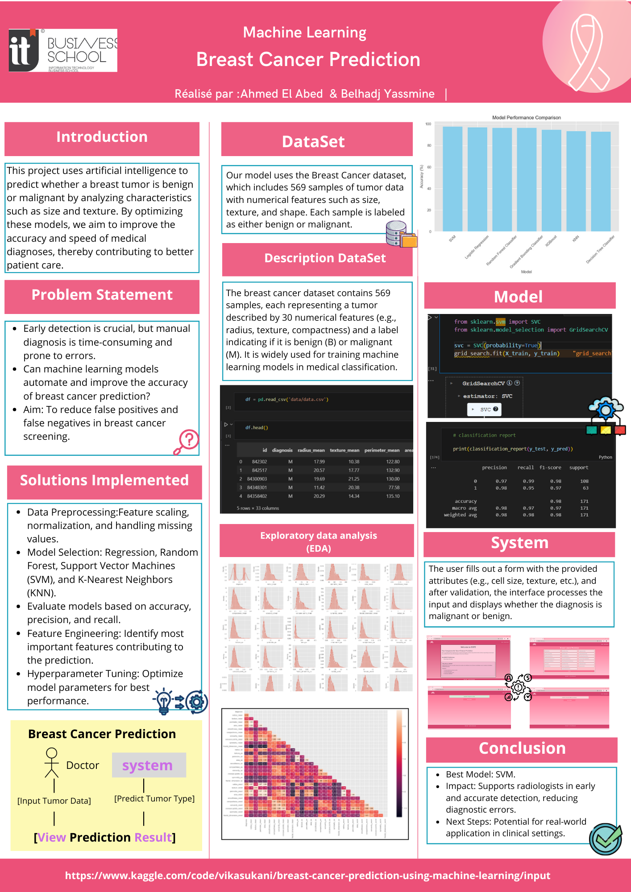

# Hope: Smart Disease Predictor

This project uses **Streamlit**, **Pandas**, and **Scikit-learn** to predict the presence of breast cancer using machine learning algorithms.

## Technologies Used

- Python 🐍
- Streamlit 📊
- Scikit-learn 🤖
- Pandas 🧮

## Project Structure

